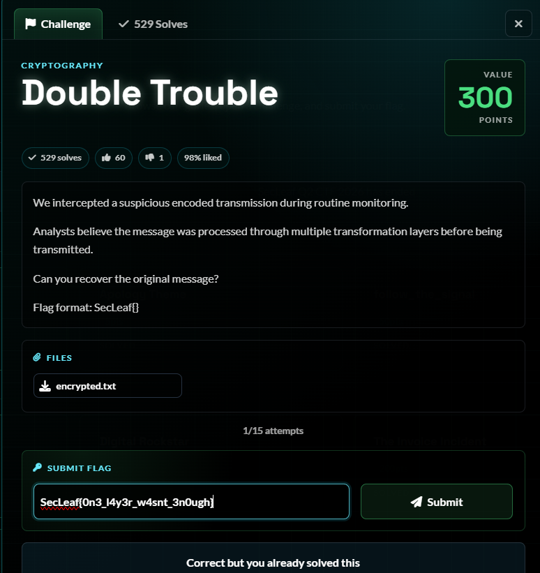
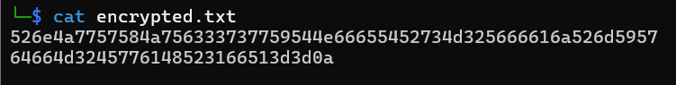
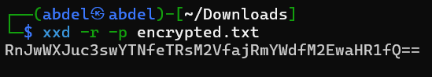
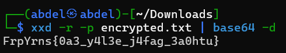
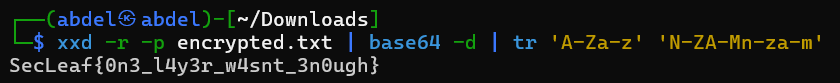

# 5NU5_Writeup_Double Trouble

Double Trouble

1.Challenge Details:

Challenge Name: Double Trouble Category: CRYPTOGRAPHY Team Name: 5NU5 Solver: x4bdelx

2.Challenge Overview:

3.Process

It's a hex-encoded string (all characters are 0-9 and a-f).

3.1 Hex decode

This is clearly Base64 (notice the = padding at the end).

3.2 Base64 decode

FrpYrns == SecLeaf

3.3 ROT13 decode

Checking the shift: F → S is +13, r → e is -13 (i.e. ROT13), p → c is -13

4.Flag Retrieval:

SecLeaf{0n3_l4y3r_w4snt_3n0ugh}

## Screenshots / Evidence

