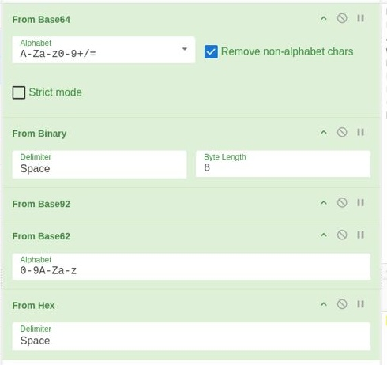
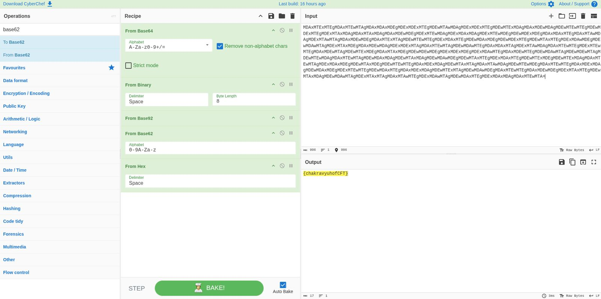

# 5NU5_Writeup_EGO

EGO

Category: DFIR

Crypto Forensic Technology

Team 5NU5

Solver Name: 4l1l7d1d

Details :

Points : 300 pts

Solves : 104 Solves

80% Liked

File : https://drive.google.com/file/d/1dO8FvWW1fEKwrv_3xHR9trSsIzHM2qP1/view

Description : 

We asked three forensic analysts to solve this challenge. One disappeared. One changed domain. One said “This is definitely Base64” and never returned. Good Luck! 

Challenge overview:

Initial observation: the input was a long text string using characters commonly found in Base64. After the first decoding step, the output resembled binary bytes separated by spaces, which indicated that another transformation was required.

Enumeration & Analysis : 

CyberChef

Identified decoding chain: Base64 -> Binary -> Base92 -> Base62 -> Hex.

Process Step-by-step : 

Paste the encoded challenge data into the CyberChef input area.

Add From Base64 and enable the option to remove non-alphabet characters.

Add From Binary with delimiter set to Space and byte length set to 8.

Add From Base92 to decode the next layer.

Add From Base62 and use the alphabet 0-9A-Za-z.

Add From Hex. The output becomes readable and shows {chakravyuhofCFT}.

Flag :

CyberChef displayed the recovered flag body: 

{chakravyuhofCFT} 

By applying the required prefix, the final flag is:

Secleaf{chakravyuhofCFT}

Conclusion :

## Screenshots / Evidence

