# 5NU5_Writeup_Force push wont save you

Force-push-wont-save-you

1.Challenge Details

Challenge Name: Force-push-wont-save-you Category: FORENSICS Team Name: 5NU5 Solver: x4bdelx

2.Challenge Overview

3.Process

3.1 Extract l’archive

3.2 Stat

3.3 View History

3.4 Recover deleted .env file 

The .env file was committed, then deleted in the next commit b7d5c13. 

The flag says "not_the_real_flag" — a decoy.

3.5 Find dangling objects

The challenge description says: "Some objects may no longer be referenced." This is a strong hint to look for dangling/unreachable objects - data that was committed but later abandoned.

Two objects exist in the database

3.6 Examine the dangling commit

A commit with message "backup before rewrite" - created right before a force-push

3.7 Examine the orphaned (lost-found/other) blob

3.8 Verify Stash

3.9 Read logs

1. 5b33ec1 → commit initial

2. 0fbc9b5 → commit: temporary env file              (ADD .env)

3. b7d5c13 → commit: remove sensitive file        (DELETE .env)

4. 3859618 → commit: final cleanup

5.         → checkout: master → backup/recovery     CREATION

6. a197682 → commit: backup before rewrite      COMMIT

7.         → checkout: backup/recovery → master     BACKUP

8.         → reset (git stash)

9. 04352ce → commit: fix

10. ebcdf22 → commit: final

Conclusion: 

The developer:

Created a backup/recovery branch

Added secrets.txt with a flag

Deleted the branch

Force-pushed master

Result: 2 orphaned objects

The Turning Point

All the "secrets" found turn out to be FAKE:

.env 		 not_the_real_flag 

secrets.txt 	 still_fake 

Orphan blob    fake_dangling_flag 

Stash diff           AKIAFAKEKEY  

They are ALL decoys. The real trap is that the investigator spends their time digging through every nook and cranny of the Git history , deleted commits, lost branches, orphaned objects, stash , without ever finding anything real. The Git history itself was the trap. 

4.Flag Retreival : 

SecLeaf{history_was_the_trap}

## Screenshots / Evidence

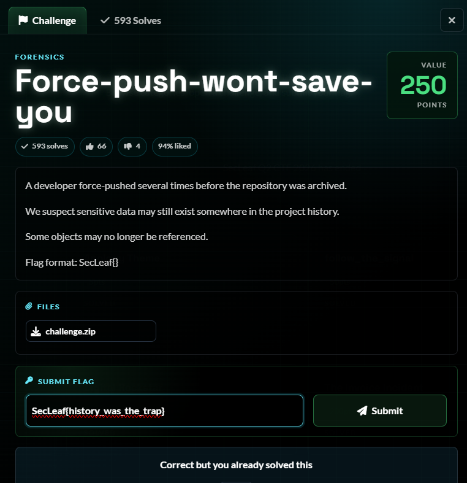

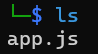

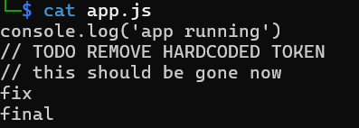

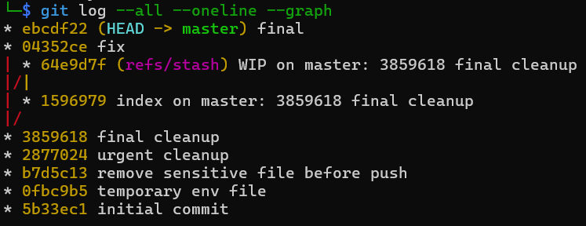

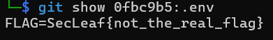

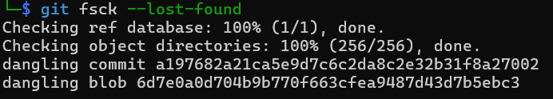

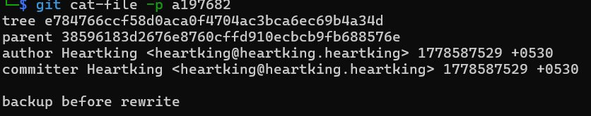

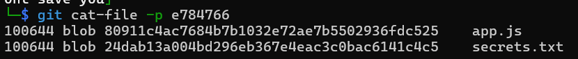

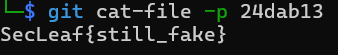

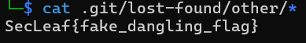

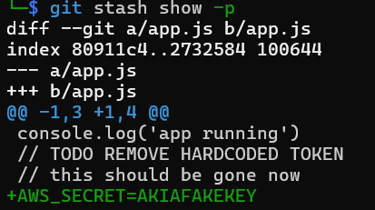

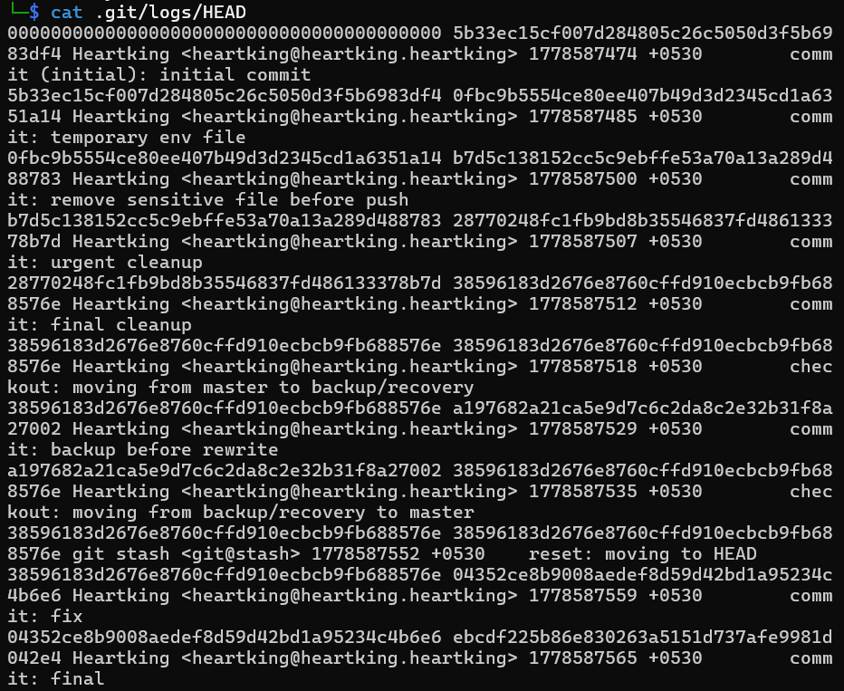

