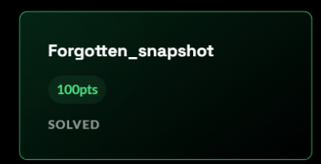
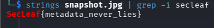
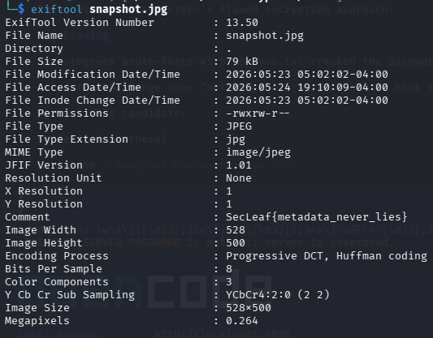

# 5NU5_Writeup_Forgotten snapshot

Forgotten_snapshot

Category: FORENSICS

Team 5NU5

Solver Name: x4bdelx

Description:

We recovered this image from a damaged backup archive.

Analysts believe the original owner attempted to conceal sensitive information before deletion.

Some image data may have survived recovery.

Flag format: SecLeaf{}

File : https://play.secleaf.tech/files/d3049826df15291fd7ed1678530d2b3a/snapshot.jpg?token=eyJ1c2VyX2lkIjo2NTUsInRlYW1faWQiOjYsImZpbGVfaWQiOjF9.ahOFhg.4VZOOBorsXotJ7ggc_PkYnHLRcU

Process:

Final Flag:

SecLeaf{metadata_never_lies}

How it was found: The JPEG comment (EXIF/JFIF metadata field) contains the flag in plain text. No steganography or decoding was needed , just a simple metadata inspection using strings or exiftool.

## Screenshots / Evidence

