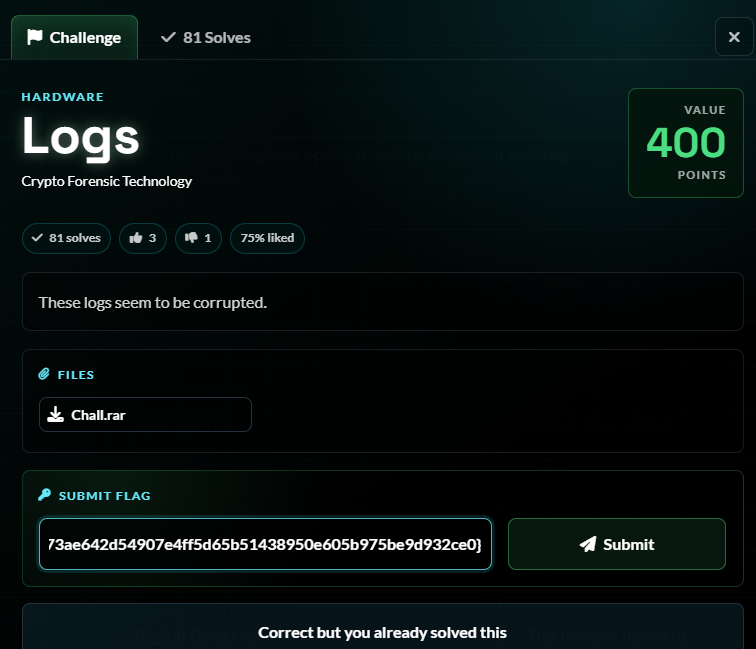
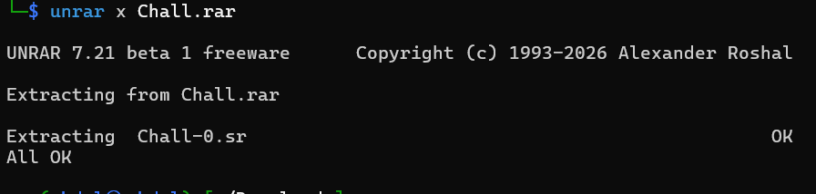
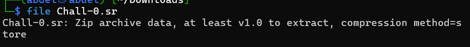
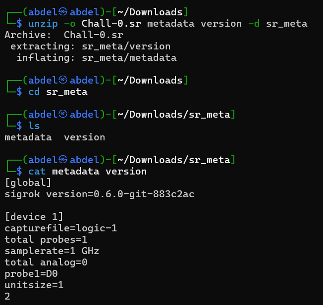
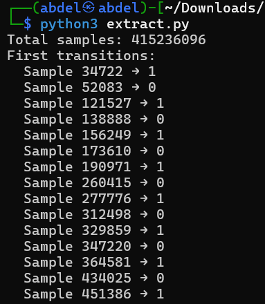
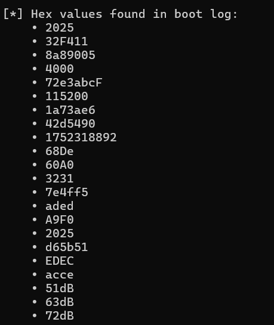
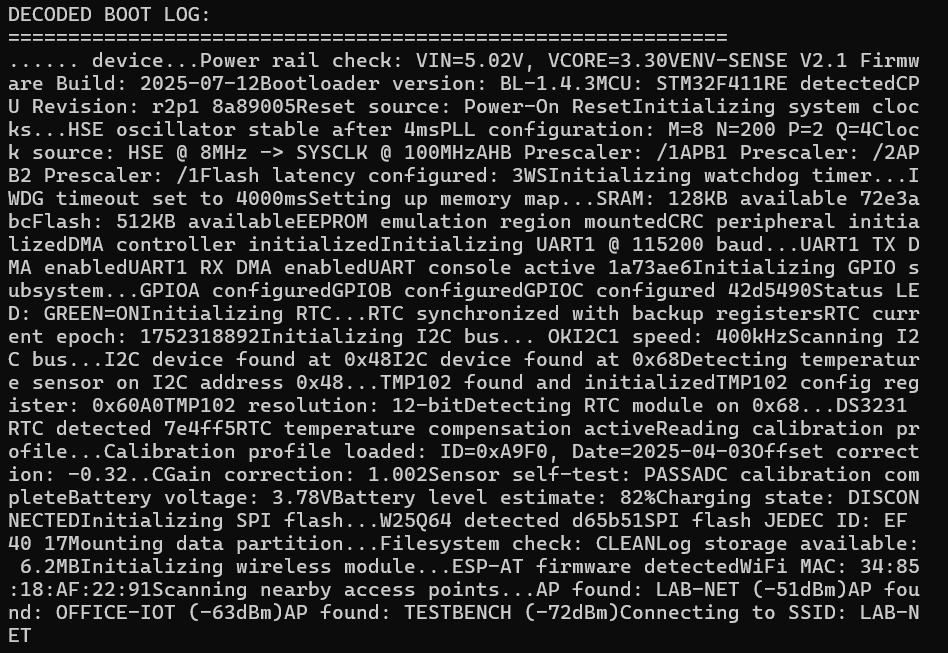
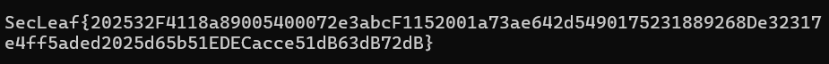

# 5NU5_Writeup_LOGS

Logs

1.Challenge Details:

Challenge Name: Logs Category: HARDWARE Team Name: 5NU5 Solver: x4bdelx

2.Challenge Overview:

3.Process

unzip

Identify 

Read metadata version 

Script python extract samples

Script identify HEX values

Script decode boot log

4.Flag Retrieval

## Screenshots / Evidence

