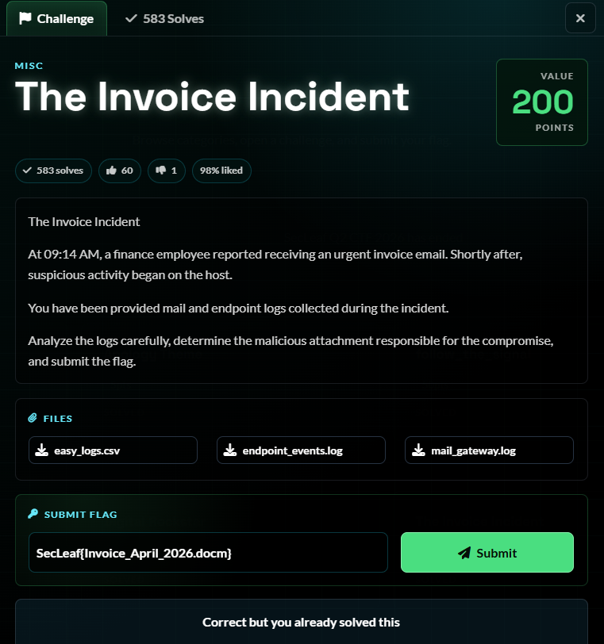
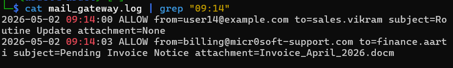
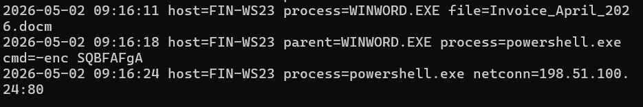
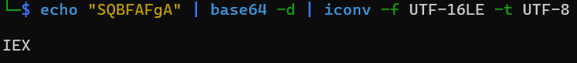
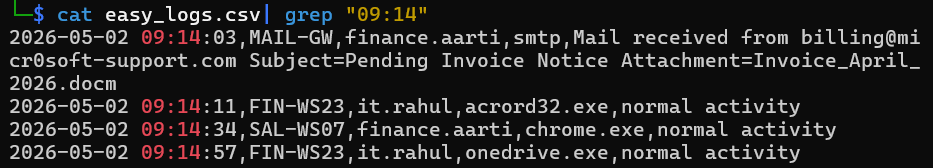

# 5NU5_Writeup_The Invoice Incident

The Invoice Incident 

1.Challenge Details

Challenge Name: The invoice Incident Category: MISC Team Name: 5NU5 Solver: x4bdelx

2.Challenge Overview

3.Process:

3.1 Analyze the mail gateway log

3.2 Correlate with endpoint events

3.3 Decode the PowerShell command

3.4  Cross-reference with easy_logs.csv

4. Analyse:

Indicators of Compromise (IoCs)

Phishing Sender: billing@micr0soft-support.com

Malicious attachement: Invoice_April_2026.docm

Initial access: Macro in .docm → WINWORD.EXE

PowerShell encoded command: -enc SQBFAFgA  = IEX

5. Flag Retrieval:

SecLeaf{Invoice_April_2026.docm}

## Screenshots / Evidence

