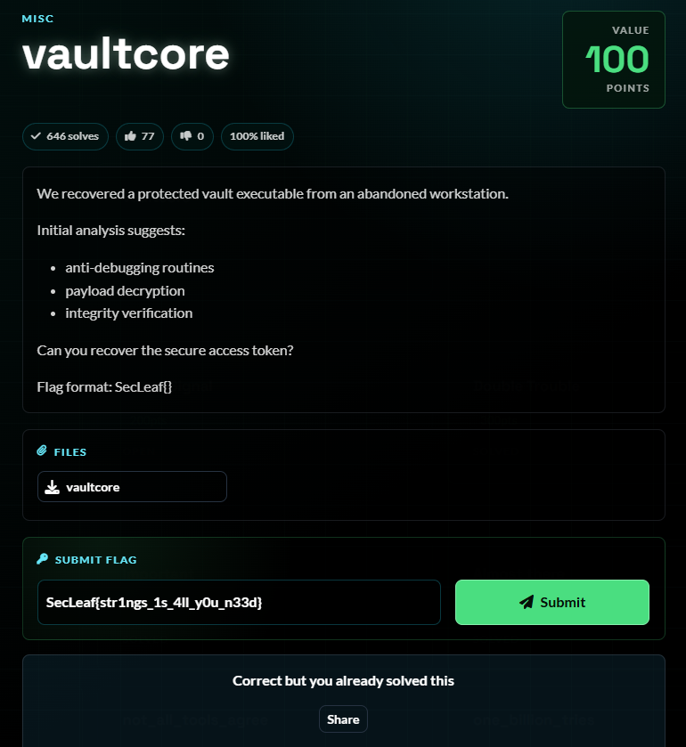
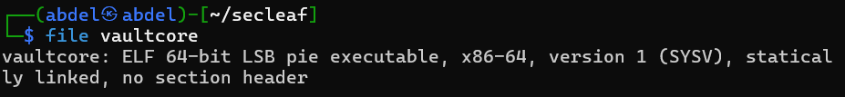
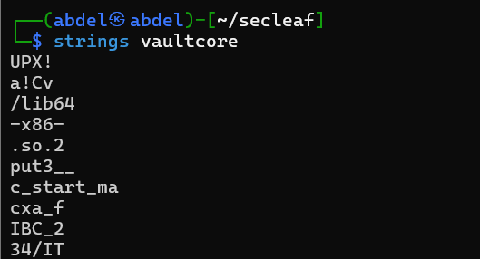
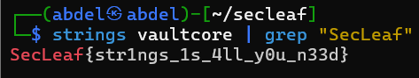

# 5NU5_Writeup_Vaultcore

Vaultcore

1.Challenge Details:

Challenge Name: Vaultcore Category: MISC Team Name: 5NU5 Solver: x4bdelx

2.Challenge Overview:

3.Process

Description:

We recovered a protected vault executable from an abandoned workstation.

Initial analysis suggests:

anti-debugging routines

payload decryption

integrity verification

Can you recover the secure access token?

3.1 Identify the file type

ELF binary  64-bit, statically linked (no external library dependencies), no section header

3.2 Extract all readable strings

3.3 Extract all readable strings

4.Flag Retrieval:

SecLeaf{str1ngs_1s_4ll_y0u_n33d}

## Screenshots / Evidence

