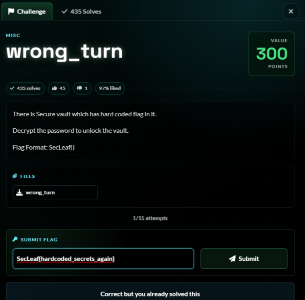
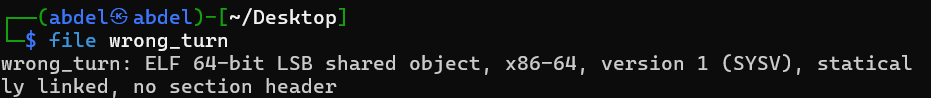
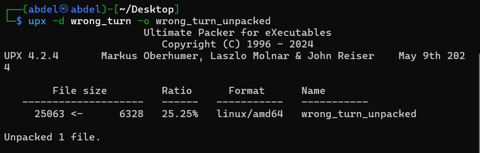
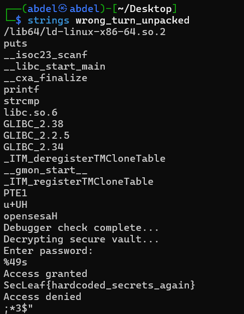

# 5NU5_Writeup_Wrong Turn

Wrong_turn

1.Challenge Details

Challenge Name: Wrong_turn Category: MISC Team Name: 5NU5 Solver: x4bdelx

2.Challenge Overview

3.Process

3.1 Identify: ELF

3.2 Unpack:

Unpacked from 6,328 bytes → 16,184 bytes.

3.4 strings analysis on unpacked binary:

4.Flag Retrieval:

SecLeaf{hardcoded_secrets_again}

## Screenshots / Evidence

