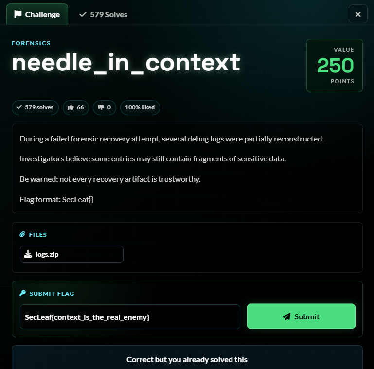
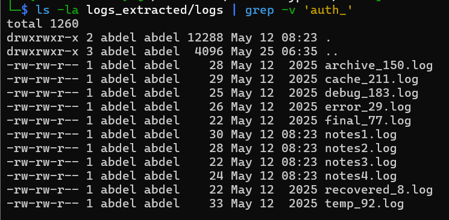
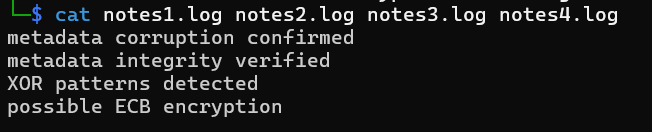
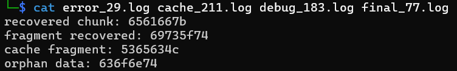
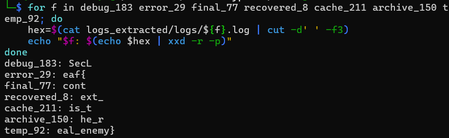

# 5NU5_Writeup_needle in context

needle_in_context

1.Challenge Details 

Challenge Name: needle_in_context Category: Forensics Team name: 5NU5 Solver: x4bdelx

2.Challenge Overview:

3.Process:

3.1  ls Extract everything

3.2 Identify the non-auth files

3.3 Concatenate of files

Each contains a hex-encoded string after a descriptive label.

3.4 Decode each hex

4. Flag Retrieval :

SecLeaf{context_is_the_real_enemy}

## Screenshots / Evidence

