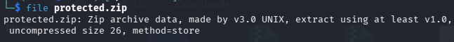
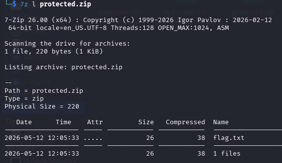
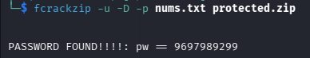
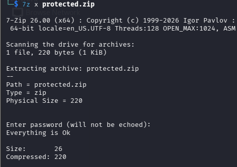
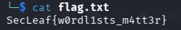

# 5NU5_Writeup_one billion tries

one_billion_tries

1.Challenge Details 

Challenge Name: one_billion_tries Category: FORENSICS Team Name:5NU5 Solver: x4bdelx

2.Challenge Overview

3.Process 

Initial Analysis

The archive was identified as a standard ZIP encrypted file.

file protected.zip

Listing contents:

7z l protected.zip

Investigation Clue

The challenge explicitly mentioned: “weak numeric pattern”

This strongly suggested:

Numeric-only password 

Possibly repeated/sequential digits 

Human-generated weak password 

Examples considered:

123456 

112233 

987654321 

Phone-like patterns 

Sequential number combinations 

Password Recovery Strategy

Because the password was likely weak and numeric, a custom numeric wordlist attack was chosen instead of a full brute force.

Building the Wordlist

A targeted numeric wordlist was generated using common patterns.

Example script:

for i in \
123456 \
12345678 \
987654321 \
111111 \
000000 \
9697989299
do
    echo $i
done > nums.txt

Password Cracking

Command used:  fcrackzip -u -D -p nums.txt protected.zip

Archive Extraction

The archive was extracted using:  7z x protected.zip

Password entered:  9697989299

Flag Recovery

4.Flag Retrieval

SecLeaf{w0rdl1sts_m4tt3r}

## Screenshots / Evidence

