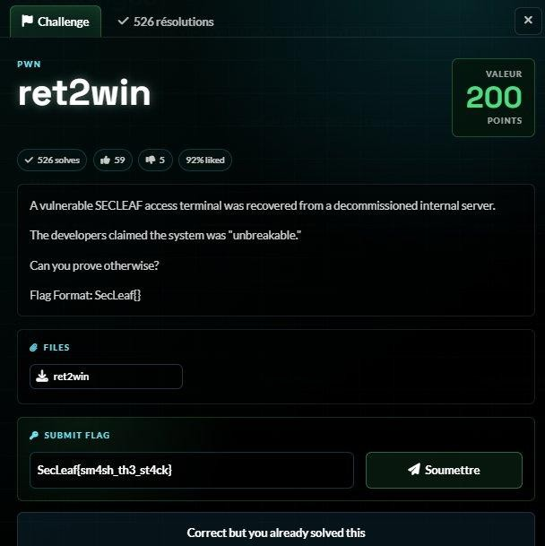
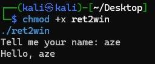
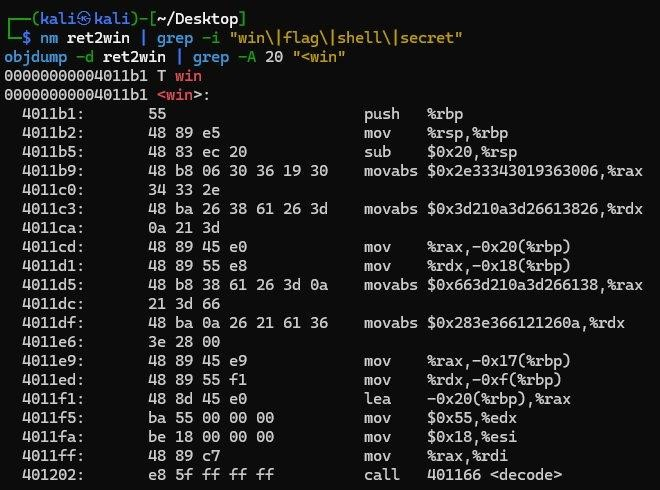
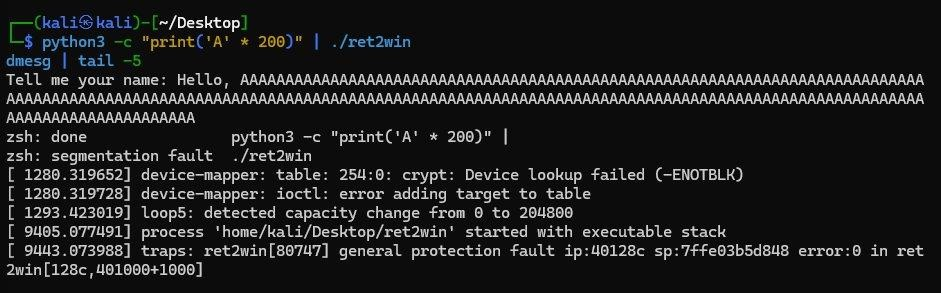
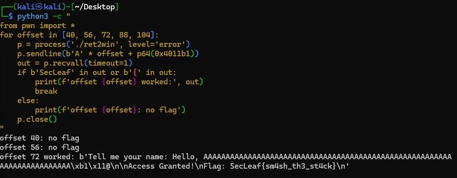

# 5NU5_Writeup_ret2win

ret2win

Challenge Details

Challenge Name: ret2win Category: PWN Points: 200 Team Name: 5NU5 Solver: x4bdelx

Challenge Overview

A 64-bit binary that takes user input. Classic buffer overflow to redirect execution to a hidden win function.

Enumeration & Analysis

Ran the binary — it asks for a name and prints it back. Simple input handler.

Used nm and objdump to find a win function at address 0x4011b1 that decodes and prints the flag.

Sent 200 A's to confirm the binary crashes with a segfault — buffer overflow confirmed.

Vulnerability Identification

The input buffer has no bounds checking. By overflowing it we can overwrite the return address and redirect execution to the win function.

Exploitation Process

Used pwntools to brute force the offset. Tried 40, 56, 72 — offset 72 worked. Sent 72 A's followed by the win function address packed as a 64-bit little-endian value.

Output: Access Granted! Flag: SecLeaf{sm4sh_th3_st4ck}

Flag Retrieval

Flag: SecLeaf{sm4sh_th3_st4ck}

## Screenshots / Evidence

